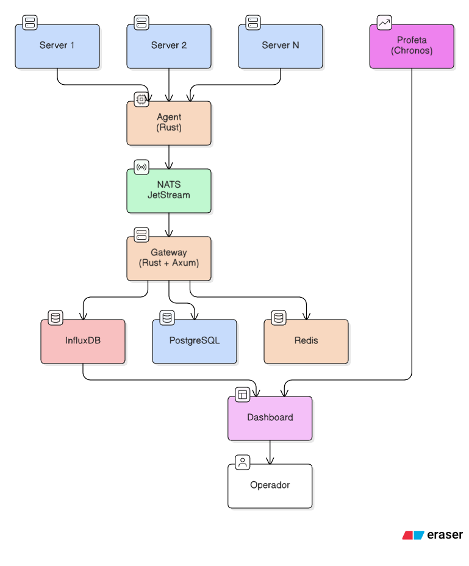

```
╔════════════════════════════════════════════════════════════════╗
║                                                                ║
║     ██████╗ ██████╗ ██████╗  █████╗ ███████╗███████╗██╗   ██╗  ║
║    ██╔════╝██╔═══██╗██╔══██╗██╔══██╗╚══███╔╝╚══███╔╝╚██   ██╗  ║
║    ██║     ██║   ██║██║  ██║███████║  ███╔╝   ███╔╝  ╚████╔╝   ║
║    ██║     ██║   ██║██║  ██║██╔══██║ ███╔╝   ███╔╝   ██╔╝      ║
║    ╚██████╗╚██████╔╝██████╔╝██║  ██║███████╗███████╗██╔╝       ║
║     ╚═════╝ ╚═════╝ ╚═════╝ ╚═╝  ╚═╝╚══════╝╚══════╝╚═╝        ║
║                                                                ║
║             Sistema de Monitorización Predictiva               ║
╚════════════════════════════════════════════════════════════════╝
```

[](https://www.gnu.org/licenses/agpl-3.0)
[](https://www.rust-lang.org/)
[](https://github.com/tokio-rs/axum)
[](https://nextjs.org/)
[](https://www.docker.com/)
[](https://www.influxdata.com/)
[](https://www.postgresql.org/)
[](https://redis.io/)
[](https://huggingface.co/amazon/chronos-2)

Monitorización de infraestructura IT con predicción de métricas usando modelos de series temporales. Despliega agentes en tus servidores, recolecta métricas en tiempo real, y anticipa problemas antes de que ocurran.

---

## Por qué Codazzy

La mayoría de sistemas de monitorización te avisan **cuando ya hay un problema**. Codazzy usa [Amazon Chronos](https://huggingface.co/amazon/chronos-2) para predecir el comportamiento futuro de CPU, memoria, disco y red. Si tu servidor va a quedarse sin espacio en 3 días, lo sabrás hoy.

Chronos-2: From Univariate to Universal Forecasting

Author: Abdul Fatir Ansari and Oleksandr Shchur and Jaris Küken and Andreas Auer and Boran Han and Pedro Mercado and Syama Sundar Rangapuram and Huibin Shen and Lorenzo Stella and Xiyuan Zhang and Mononito Goswami and Shubham Kapoor and Danielle C. Maddix and Pablo Guerron and Tony Hu and Junming Yin and Nick Erickson and Prateek Mutalik Desai and Hao Wang and Huzefa Rangwala and George Karypis and Yuyang Wang and Michael Bohlke-Schneider

Year: 2025

Url: https://arxiv.org/abs/2510.15821

**Lo que hace diferente:**

- **Predicciones reales** — No reglas estáticas. Modelos de deep learning entrenados en miles de series temporales.
- **Zero config** — El instalador detecta GPU, genera credenciales y levanta todo.
- **Agentes ligeros** — Binarios Rust de ~5MB. Sin runtime, sin dependencias.
- **Despliegue remoto** — Instala agentes en servidores vía SSH desde el dashboard.
- **Discovery de red** — Escanea rangos IP, detecta dispositivos SNMP, mapea topología.

---

## Stack

| Componente | Tecnología | Función |
|------------|------------|---------|
| **Dashboard** | Next.js 15, React 19, Tailwind | Interfaz web |
| **Gateway** | Rust, Axum, Tokio | API REST, WebSocket, procesamiento |
| **Profeta** | Python, Chronos 2 | Predicciones ML |
| **Agente** | Rust | Recolección de métricas |
| **InfluxDB** | v2.7 | Series temporales |
| **PostgreSQL** | 16 + pgvector | Embeddings |
| **NATS** | JetStream | Mensajería entre agentes y gateway |
| **Redis** | 7.2 | Cache predicciones manuales |

---

## Instalación rápida

```bash
git clone repo
cd codazzy
./install.sh
```

El script:
1. Verifica Docker y Docker Compose
2. Detecta GPU NVIDIA (opcional, para ML más rápido)
3. Genera `.env` con credenciales seguras
4. Construye imágenes
5. Levanta servicios
6. Espera a que todo esté healthy

Al terminar:
- **Dashboard:** http://localhost:7245
- **API:** http://localhost:8000
- **Chronos:** http://localhost:9021

---

## Requisitos

**Mínimos:**
- Docker 24+
- Docker Compose v2
- 8GB RAM
- 20GB disco

**Recomendados:**
- 16GB+ RAM
- GPU NVIDIA con 6GB+ VRAM
- SSD

---

## Arquitectura Global





Los agentes envían métricas cada segundo vía NATS. El gateway las procesa, escribe en InfluxDB, detecta anomalías y expone todo por API. El dashboard consulta al gateway y a Profeta para mostrar datos históricos y predicciones.

---

## Comandos

```bash
make start      # Iniciar servicios
make stop       # Detener
make status     # Ver estado de contenedores
make logs       # Para ver las ultimas 100 lineas
make logs-f     # Para ver los logs en tiempo real
make gpu        # Iniciar con soporte GPU
make build      # Reconstruir imágenes
make purge      # Eliminar todos los contenedores y datos!!! (CUIDADO)
```

O directamente con Docker Compose:

```bash
docker compose up -d
docker compose down
docker compose logs -f gateway-rs
```

---

## Configuración

Edita `.env` después de la instalación:

```env
# Modelo de predicción (más grande = más preciso pero más lento)
CHRONOS_MODEL=amazon/chronos-2

# OpenAI para análisis de umbrales con IA (opcional)
OPENAI_API_KEY=sk-...
OPENAI_MODEL=gpt-5-nano

Si quieres generar reportes automatizados... conecta OpenAI
(en futuras versiones tendrá soporte para otros proveedores / modelos remotos y locales)

# Ajustar puertos si hay conflictos con otros contenedores docker en tu sistema
DASHBOARD_PORT=7245
GATEWAY_PORT=8000
```

**Modelos Chronos (primera versión) disponibles:**

| Modelo | Parámetros | VRAM | Velocidad |
|--------|------------|------|-----------|
| chronos-t5-tiny | 8M | 2GB | Muy rápida |
| chronos-t5-mini | 20M | 3GB | Rápida |
| chronos-t5-small | 46M | 4GB | Media |
| chronos-t5-base | 200M | 6GB | Lenta |
| chronos-t5-large | 710M | 12GB | Muy lenta |
| chronos-bolt-tiny | 9M | 1GB | Muy rápida |
| chronos-bolt-mini | 21M | 1.5GB | Muy rápida |
| chronos-bolt-small | 48 M | 2GB | Rápida |
| chronos-bolt-base | 205M | ~4GB | Media |
| chronos-2 | 120M | ~4GB | Media |

**Modelo Chronos versión 2 (más actual)** 

CHRONOS_MODEL=amazon/chronos-2

| Capability |	Chronos-2 | Chronos-Bolt | Chronos |
|--------|------------|------|-----------|
| Univariate Forecasting |	✅ |	✅ |	✅ |
| Cross-learning across items |	✅ |	❌ |	❌ |
| Multivariate Forecasting |	✅ |	❌ |	❌ |
| Past-only (real/categorical) covariates |	✅ |	❌ |	❌ |
| Known future (real/categorical) covariates |	✅ |	🧩 |	🧩 |
| Max. Context Length	| 8192 | 2048 |	512 |
| Max. Prediction Length	| 1024 |	64 |	64 |

---

## Agente

El agente es un binario Rust que corre en los servidores a monitorizar. Recolecta:
- CPU % de uso
- Memoria % de uso
- Disco % de uso
- Red (tráfico por interfaz del sistema)
- Procesos (top 10 procesos)
- Info del sistema

**Despliegue desde el dashboard:**

El dashboard permite instalar agentes en servidores remotos vía SSH (de momento solo Linux). 
Solo necesitas credenciales SSH y el agente se despliega automáticamente (hace falta sudo).

**Despliegue manual:**

```bash
cd agent
cargo build --release
# Copiar target/release/codazzy-agent al servidor
# Configurar config.toml con la URL del NATS
```

---

## GPU NVIDIA

Si tienes GPU NVIDIA, Profeta la usará para las predicciones:

```bash
# Con este comando puedes comprobar si está correctamente configurado, verificar que funciona
nvidia-smi
docker run --rm --gpus all nvidia/cuda:12.0-base nvidia-smi

# El instalador detecta GPU automáticamente o se puede forzar en el .env, asegurate de tener soporte CUDA
USE_GPU=true
```

Requisitos:
- NVIDIA Container Toolkit

---

## Estructura del proyecto

```
codazzy/
├── agent/              # Agente/Sonda
├── dashboard/          # Frontend
├── gateway-rs/         # Backend Rust
├── profeta/            # Servicio de predicciones (Chronos)
├── docker-compose.yml
├── install.sh
└── Makefile
```

---

## Troubleshooting

**El gateway tarda en arrancar**

Normal. La primera vez compila el proyecto Rust (~2-3 min). Los siguientes arranques son instantáneos gracias al cache.

**Profeta tarda en responder**

El modelo Chronos tarda 1-3 minutos en cargar en memoria. El healthcheck espera a que esté listo.

**No hay espacio en disco**

```bash
# Ejecutar con precaución
docker system prune -a
```

**Ver logs de un servicio específico**

```bash
make logs-gateway
make logs-dashboard
make logs-profeta
```

---

## API

El gateway expone una API REST documentada en `gateway-rs/README.md`. Endpoints principales:

- `GET /api/v1/metrics/agents` — Resumen de todos los nodos
- `GET /api/v1/metrics/timeseries` — Series temporales
- `POST /api/v1/discovery/scan/start` — Iniciar escaneo de red
- `GET /api/v1/alerts/predictions` — Predicciones de alertas
- `GET /api/v1/predictions/:node_id` — Predicciones para un servidor

---

## Autor

Armando José Freitas Bontempo

## Licencia

Este proyecto está bajo la licencia **GNU Affero General Public License v3.0 (AGPL-3.0)**.

Esto significa que:
- Puedes usar, modificar y distribuir este software
- Si distribuyes versiones modificadas, debes liberar el código fuente
- Si ofreces este software como servicio (SaaS), también debes liberar el código
- Debes mantener la atribución al autor original

Ver [LICENSE](LICENSE) para el texto completo.
